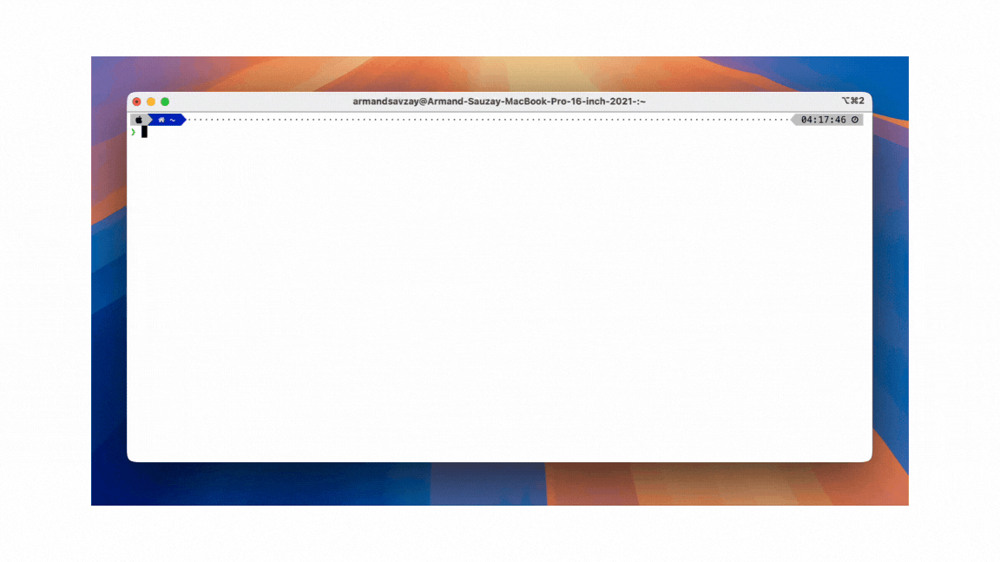

<h1 align="center">Note ✍️</h1>

<p align="center">
  
</p>

A modern terminal-based note-taking application built with [Bubble Tea](https://github.com/charmbracelet/bubbletea) and [Lip Gloss](https://github.com/charmbracelet/lipgloss). Organize your thoughts with style right from your terminal.

## ✨ Features

- 📝 Create and edit markdown notes
- 🗂️ Organize notes in folders
- 🎨 Beautiful TUI with syntax highlighting
- 📱 Responsive layout with adjustable sidebar
- 🗑️ Archive unused notes
- ⌨️ Vim-style keybindings
- 🎯 Focus mode without sidebar
- 🔍 Preview markdown rendering
- ⚡ Fast and lightweight

## 📦 Installation

### Using Homebrew (macOS & Linux)

```bash
brew tap armand-sauzay/homebrew-tap
brew install note
```

### Using Go

```
go install github.com/armand-sauzay/note@latest
```

### From Source

```
git clone https://github.com/armand-sauzay/note.git
cd note
go install .
```

## 🚀 Usage

## ⚙️ Configuration

### Keybindings

- `j/k` or `↑/↓`: Navigate notes
- `h/l` or `←/→`: Collapse/expand folders
- `enter`: Edit note/rename folder
- `n`: Create new note
- `N`: Create new folder
- `tab`: Toggle sidebar
- `backspace`: Archive note/folder
- `q` or `ctrl+c`: Quit

## 🤝 Contributing

Contributions are welcome! Please feel free to submit a Pull Request.

1. Fork the repository
2. Create your feature branch (`git checkout -b feature/amazing-feature`)
3. Commit your changes (`git commit -m 'feat: add amazing feature'`)
4. Push to the branch (`git push origin feature/amazing-feature`)
5. Open a Pull Request

## 📝 License

This project is licensed under the MIT License - see the [LICENSE](LICENSE) file for details.

## 🚧 Roadmap

- [ ] Custom themes
- [ ] Tags
- [ ] Sorting notes
- [ ] Search notes
- [ ] Export notes
